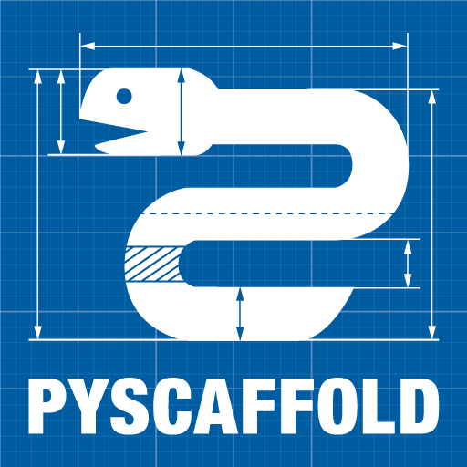

Making Changes & Contributing
=============================

This project uses `pre-commit`_, which is included in the provided [conda](https://conda.io)
`environment.yml` file. Please create and activate the conda environment, setup the git hook
scripts, and update pre-commit hooks::

    conda env create -f environment.yml
    pre-commit install
    pre-commit autoupdate

.. _pre-commit: https://pre-commit.com/

.. Update the url for CONTRIBUTING and uncomment:

    .. Please review our `CONTRIBUTING`_ guide before creating an issue and pull/merge request.

    .. .. _CONTRIBUTING: -[URL to package repo]/-/blob/main/CONTRIBUTING.rst

Citing [new-package]
====================

We release the latest version of [new-package] through the project's Zenodo archive using DOI: [TBD].
This DOI is a `concept DOI`_ which means it will always resolve to the latest version.
If you need to cite a specific version you can find those DOIs at the zenodo page above. 
DOIs allow us to archive the repository and they are really valuable to ensure that the work is tracked in publications.

.. _concept DOI: https://help.zenodo.org

The citation will look something like this:

    [New Package]. (YYY, Month dd). [New Package]: [New package subtitle, perhaps]. Zenodo. [DOI link]

.. Update url for RELEASE_WORKFLOW and uncomment:

    .. To see our workflow for making releases for different versions and to suggest improvements, please head over to the `RELEASE_WORKFLOW`_ document.

    .. _RELEASE_WORKFLOW: -[URL to package repo]/-/blob/main/RELEASE_WORKFLOW.md

Note
====

This project endeavors to follow `The Turing Way`_ of reproducible research.

.. _The Turing Way: https://the-turing-way.netlify.app/welcome.html

This project has been setup using `PyScaffold`_ 4.3.1. 

.. _PyScaffold: https://pyscaffold.org/

Generation of data documentation in the `data` folder uses `quarto`_.

|

.. image:: quarto.png
  :height: 50
  :alt: Quarto logo